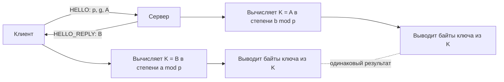
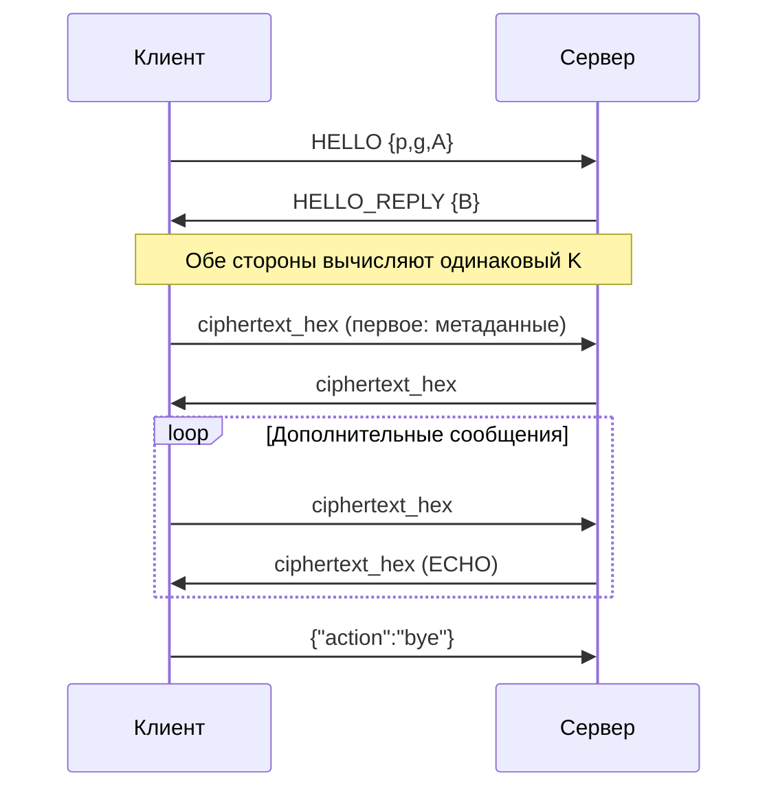

# Лабораторная работа №15  `lab15_assymetric_encryptions`: асимметричная криптография и согласование ключей (Диффи–Хеллман)

*Идентификатор задания сохранён в имени файла; в научной литературе используется термин **асимметричное** шифрование / криптография.*

---

## 1. Тема и цель работы

**Тема:** асимметричная криптография в задаче согласования ключа (Diffie–Hellman, DH) и учебный защищённый обмен сообщениями между клиентом и сервером.

**Цель:** реализовать и объяснить полный цикл:

1. согласование общего секрета без передачи секрета по сети;
2. получение ключевого материала из общего секрета;
3. шифрование/дешифрование учебного сообщения между клиентом и сервером (в зашифрованном виде передаются ФИО, группа, номер; сервер после расшифрования отображает эти поля).

Работа выполняется в Linux Mint VM (Oracle VirtualBox) в консольном режиме.

---

## 2. Теоретическая основа

### 2.1. Симметричное и асимметричное шифрование

**Симметричное шифрование** использует один общий секретный ключ для шифрования и дешифрования. Проблема: этот ключ нужно безопасно передать второй стороне.

### 2.2. Асимметричная криптография** использует пару ключей:

- публичный ключ (можно распространять);
- приватный ключ (должен оставаться только у владельца).

На практике асимметричные методы часто применяются не для шифрования больших данных, а для:

- аутентификации;
- обмена/согласования ключей;
- цифровой подписи.

### 2.2. Что делает DH

Протокол Диффи–Хеллмана решает задачу **согласования общего секрета** в небезопасном канале.

Стороны используют:

- публичные параметры: `p`, `g`;
- приватные значения: `a` (клиент), `b` (сервер);
- публичные компоненты: `A = g^a mod p`, `B = g^b mod p`.

После обмена `A` и `B` обе стороны вычисляют один и тот же секрет:

- клиент: `K = B^a mod p`;
- сервер: `K = A^b mod p`.

Совпадение обеспечивается свойствами модульной арифметики:

`B^a mod p = (g^b)^a mod p = g^(ab) mod p = (g^a)^b mod p = A^b mod p`.

### 2.3. Что DH не делает

DH в базовой форме **не аутентифицирует** стороны. Следствие: возможна атака «человек посередине» (MITM), если атакующий подменяет публичные значения.

### 2.4. Почему это учебная модель

В лаборатории используется:

- `SHA-256` как простой преобразователь `K → байты`;
- XOR для демонстрационного шифрования.

Это полезно для обучения потоку данных, но **не является production-решением**. В реальных системах применяют аутентифицированный обмен ключами и AEAD-шифры (например, TLS 1.2+/1.3, AES-GCM, ChaCha20-Poly1305).

### 2.5. Как это связано с TLS

TLS-рукопожатие в практическом смысле делает четыре вещи:

1. согласует алгоритмы;
2. проверяет подлинность сервера (сертификат);
3. устанавливает общий сессионный ключ;
4. защищает прикладной трафик.

Именно поэтому в промышленной эксплуатации используют не «чистый» DH, а DH/ECDH вместе с аутентификацией.

### 2.6. Мини-словарь терминов

- **Ключевое согласование (key agreement):** способ получить общий секрет без прямой передачи этого секрета.
- **`p` (модуль):** большое простое число, задаёт арифметику по модулю.
- **`g` (генератор):** базовое публичное число для вычисления публичных компонентов.
- **`a`, `b`:** приватные случайные значения клиента и сервера.
- **`A`, `B`:** публичные компоненты.
- **`K`:** общий секрет после обмена `A` и `B`.
- **KDF:** функция вывода ключей; в лаборатории роль KDF упрощённо играет `SHA-256`.
- **MITM:** активная подмена трафика между сторонами.
- **AEAD:** шифрование с защитой конфиденциальности и целостности.

---

## 3. Диаграммы протокола

### 3.1. Логика обмена и вычисления общего секрета



### 3.2. Последовательность сообщений в лаборатории



### 3.3. Несколько сообщений в одном соединении

После вычисления общего ключа `K` клиент и сервер **не закрывают** TCP сразу: вводится **цикл чата**.

- Каждое сообщение по сети — JSON **одной строкой**, в конце **символ перевода строки** `\n` (чтобы при нескольких подряд пакетах `json.loads` не склеивал два объекта в один буфер). В коде это делается через `socket.makefile` и `readline()` / запись строки с `\n`.
- **Первое** зашифрованное сообщение после рукопожатия — по-прежнему строка с `student_name=...; student_group=...; student_number=...`.
- **Следующие** сообщения — произвольный текст; сервер отвечает шифротекстом с префиксом `ECHO: ...`.
- Завершение сеанса: клиент отправляет объект `{"action": "bye"}` (без шифрования) и выходит; сервер выходит из цикла для этого клиента.

Так один клиент может отправить **много** сообщений подряд; при **`multi-threaded-server.py`** несколько клиентов работают **параллельно**, у каждого свой поток и свой `K`.

---

## 4. Структура файлов лаборатории

- `starter/dh_utils.py` — математика DH и вывод ключевого материала;
- `starter/server.py` — сервер: рукопожатие, затем **цикл** приёма `ciphertext_hex` или `bye`, ответы `ECHO` для чата;
- `starter/client.py` — клиент: рукопожатие, первое сообщение с метаданными, затем **цикл** дополнительных сообщений и `bye`;
- `starter/multi-threaded-server.py` — **расширение после базового сервера:** несколько клиентов одновременно (см. задание после успешного запуска `server.py` + `client.py`);

### 4.1. Где пишет код и где ответы

- `TODO(student, YOUR CODE HERE)` — дописать код.
- `YOUR ANSWER HERE` — текст в отчёте (`REPORT.md` or `result.txt`).

**Обязательные правки в `starter`:**

1. `client.py` 
2. `server.py` 
3. `dh_utils.py` 

### 4.2. Полный код из каталога `starter/` (как дописывать)

**Актуальность:** протокол после DH (JSON **по одной строке** с `\n`, цикл чата, `{"action":"bye"}`) описан в **п. 3.3**; эталон — файлы **`starter/*.py`**. Фрагменты ниже могут отличаться (например, вариант с `recv(4096)`); ориентируйтесь на код в каталоге `starter/`.

Ниже — **полный текст** трёх файлов, как они лежат в репозитории. Студент редактирует **именно эти файлы** в папке `starter/`.

- Строки с **`TODO(student)`** или **`TODO(student, YOUR CODE HERE)`** — нужно проверить, дописать или заменить заглушку по заданию.
- Остальной код связывает протокол: HELLO → `B` → общий `K` → XOR → первое сообщение с метаданными → при необходимости **дополнительные** сообщения и `bye` (см. п. 3.3).

#### `starter/dh_utils.py`

```python
import hashlib


def public_component(g: int, private_value: int, p: int) -> int:
    """Compute public value: g^private mod p."""
    # TODO(student): implement with modular exponentiation.
    #pow(base, exponent)          # 2 arguments: base^exponent
    #pow(base, exponent, mod)     # 3 arguments: (base^exponent) % mod
    return pow(?????,؟؟؟؟, p)


def shared_secret(peer_public: int, private_value: int, p: int) -> int:
    """Compute shared secret: peer_public^private mod p."""
    # TODO(student): implement modular exponentiation.
    return pow(peer_public, private_value, ؟؟؟؟)


def derive_key_material(shared_k: int, length: int = 32) -> bytes:
    """
    Teaching KDF stub:
    - convert integer K to bytes
    - SHA-256 digest
    - return `length` bytes (truncate/repeat)
    """
    # TODO(student): stable integer-to-bytes conversion.
    k_bytes_len = max(1, (shared_k.bit_length() + 7) // 8)
    k_bytes = shared_k.to_bytes(k_bytes_len, "big")
    digest = hashlib.sha256(k_bytes).digest()

    if length <= len(digest):
        return digest[:length]

    # Repeat digest stream if longer output requested.
    repeats = (length + len(digest) - 1) // len(digest)
    return (digest * repeats)[:length]


def xor_bytes(data: bytes, key_stream: bytes) -> bytes:
    """XOR helper for teaching demo."""
    return bytes([b ^ key_stream[i % len(key_stream)] for i, b in enumerate(data)])
```

**Что сделать:** убедиться, что `public_component` и `shared_secret` используют **`pow(..., mod)`**; что `derive_key_material` даёт одинаковый результат при одинаковом `K` на клиенте и сервере.

#### `starter/client.py`

```python
import json
import secrets
import socket

from dh_utils import derive_key_material, public_component, shared_secret, xor_bytes

HOST = "127.0.0.1"
PORT = 5000


def recv_json(sock: socket.socket) -> dict:
    raw = sock.recv(4096).decode("utf-8")
    return json.loads(raw)


def send_json(sock: socket.socket, payload: dict) -> None:
    sock.sendall(json.dumps(payload).encode("utf-8"))


def is_valid_student_name(student_name: str) -> bool:
    """
    TODO(student, YOUR CODE HERE):
    Strengthen validation.
    Required by lab:
    - at least 2 characters
    - letters only (space and hyphen allowed)
    - must NOT contain ';' or '='
    """
    if ???????:
        return False
    if ";" ???? student_name or "????" ???? student_name:
        return False
    for ch in student_name:
        if ch.isalpha() or ch in {" ", "-"}:
            continue
        return ????
    return True


def ask_student_name() -> str:
    """Require student name to be entered before sending data."""
    while True:
        student_name = input("Введите ваше имя (латиница/кириллица): ").strip()
        if is_valid_student_name(student_name):
            return student_name
        print("[client] Некорректное имя, попробуйте снова.")


def ask_nonempty(prompt: str) -> str:
    """Ask for non-empty metadata field."""
    while True:
        value = input(prompt).strip()
        if value:
            return value
        print("[client] Поле не должно быть пустым.")


def main() -> None:
    # Small toy parameters for teaching only.
    p = 7919
    g = 2

    # 1) Generate client secret and public component A.
    a = secrets.randbelow(p - 2) + 2
    A = public_component(g, a, p)
    student_name = ask_student_name()
    student_group = ask_nonempty("Введите вашу группу: ")
    student_number = ask_nonempty("Введите ваш номер (в журнале/списке): ")

    with socket.socket(socket.AF_INET, socket.SOCK_STREAM) as sock:
        sock.connect((HOST, PORT))

        # 2) Send hello and receive server public component B.
        send_json(sock, {"p": p, "g": g, "A": A})
        server_reply = recv_json(sock)
        B = int(server_reply["B"])

        # 3) Derive shared secret and key.
        K_client = shared_secret(B, a, p)
        key = derive_key_material(K_client, length=32)
        print(f"[client] shared K = {K_client}")

        # 4) Encrypt and send message.
        msg = (
            f"student_name={student_name}; "
            f"student_group={student_group}; "
            f"student_number={student_number}; "
            f"message=Hello from client (encrypted)."
        ).encode("utf-8")
        ct = xor_bytes(msg, key)
        send_json(sock, {"ciphertext_hex": ct.hex()})

        # 5) Receive encrypted response and decrypt.
        enc_response = recv_json(sock)
        response_ct = bytes.fromhex(enc_response["ciphertext_hex"])
        response_pt = xor_bytes(response_ct, key)
        print(f"[client] decrypted server response: {response_pt.decode('utf-8')}")


if __name__ == "????":
    ?????
```

**Что сделать:** реализовать **`is_valid_student_name`** по правилам в docstring (сейчас заглушка `return len(student_name) >= 2`). При желании усилить **`ask_nonempty`**, чтобы группа и номер не содержали `;` и `=` (как разделители полей в строке).

#### `starter/server.py`

```python
import json
import secrets
import socket

from dh_utils import derive_key_material, public_component, shared_secret, xor_bytes

HOST = "127.0.0.1"
PORT = 5000


def recv_json(conn: socket.socket) -> dict:
    raw = conn.recv(4096).decode("utf-8")
    return json.loads(raw)


def send_json(conn: socket.socket, payload: dict) -> None:
    conn.sendall(json.dumps(payload).encode("utf-8"))


def extract_field(plaintext: str, key: str) -> str:
    marker = f"{key}="
    if marker not in plaintext:
        return ""
    return plaintext.split(marker, 1)[1].split(";", 1)[0].strip()


def main() -> None:
    with socket.socket(socket.AF_INET, socket.????) as s:
        s.bind((HOST, ????))
        s.listen(1)
        print(f"[server] listening on {HOST}:{PORT}")
        conn, addr = s.accept()
        with conn:
            print(f"[server] connected by {addr}")

            # 1) Receive client hello with p, g, A.
            hello = recv_json(conn)
            p = int(hello["p"])
            g = int(hello["g"])
            A = int(hello["A"])

            # 2) Generate server secret and public component B.
            b = secrets.randbelow(p - 2) + 2
            B = public_component(g, b, p)
            send_json(conn, {"B": B})

            # 3) Derive shared secret and key material.
            K_server = shared_secret(A, b, p)
            key = derive_key_material(K_server, length=32)
            print(f"[server] shared K = {K_server}")

            # 4) Receive encrypted client message, decrypt, respond.
            encrypted_payload = recv_json(conn)
            ct = bytes.fromhex(encrypted_payload["ciphertext_hex"])
            pt = xor_bytes(ct, key)
            plaintext = pt.decode("utf-8")
            print(f"[server] decrypted client message: {plaintext}")

            # Minimal identity check for lab accountability.
            if "student_name=" in plaintext:
                student_name = extract_field(plaintext, "student_name")
                student_group = extract_field(plaintext, "student_group")
                student_number = extract_field(plaintext, "student_number")
                print(
                    "[server] student metadata: "
                    f"name={student_name}, group={student_group}, number={student_number}"
                )
            else:
                # TODO(student, YOUR CODE HERE):
                # Replace fallback with explicit error handling:
                #  log clear error
                print("[server] ERROR: Client message missing 'student_name=' field")
                
                ###TODO
                error_response = "ERROR: Invalid message format - missing student_name".????("utf-8")
                error_ct = xor_bytes(error_response, key)
                send_json(conn, {"ciphertext_hex": error_ct.hex()})
                print("[server] error response sent, closing connection")
                return  # Exit main() to close connection safely

            response = (
                f"Hello, {student_name} (group {student_group}, number {student_number}). "
                "Server received your encrypted message."
            ).encode("utf-8")
            response_ct = xor_bytes(response, key)
            send_json(conn, {"ciphertext_hex": response_ct.hex()})
            print("[server] response sent")


if __name__ == "????":
    ????
```

**Что сделать:** заменить ветку с **`UNKNOWN`** на явную обработку ошибки (лог, не отправлять «успешный» ответ, если нет обязательных полей).

---

## 5. Подготовка окружения

```bash
python3 --version
mkdir -p ~/labs && cd ~/labs
git clone <URL_ВАШЕГО_РЕПОЗИТОРИЯ>
cd assymetric_encryption
```

---

## 6. Задания

### Задание 1. Анализ протокола до запуска

Откройте `starter/dh_utils.py`, `starter/client.py`, `starter/server.py` и ответьте:

1. Какие поля передаются по сети в открытом виде?
2. Какие значения должны оставаться секретными?
3. В какой точке обе стороны получают одинаковый `K`?

```text
YOUR ANSWER HERE (Задание 1):
1) ...
2) ...
3) ...
```

### Задание 2. Запуск и проверка

Терминал 1:

```bash
cd ~/labs/assymetric_encryption/starter
python3 server.py
```

Терминал 2:

```bash
cd ~/labs/assymetric_encryption/starter
python3 client.py
```

**Ожидаемый результат:**

1. У клиента и сервера одинаковый `K` в логах.
2. Сервер выводит расшифрованное сообщение и блок `student metadata` с именем, группой, номером.
3. Клиент выводит расшифрованный ответ сервера.

**Сдача преподавателю:** показать оба терминала, обмен зашифрованными данными, расшифровку на сервере.

```text
YOUR ANSWER HERE (Задание 2):
- Имя, группа, номер (как вводили): ...
- Фрагмент вывода сервера: ...
- Фрагмент вывода клиента: ...
- Совпадение K: да/нет (пояснение)
- Демонстрация преподавателю: да/нет
```

### Задание 3. Многопоточный сервер (`multi-threaded-server.py`)

**Когда выполнять:** только после того, как **полностью дописали**, **запустили** и **проверили** базовую пару `server.py` + `client.py` (один клиент).

**Цель:** создать файл `starter/multi-threaded-server.py` — усиленную версию `server.py`, которая **одновременно** обслуживает **несколько** клиентов (каждое подключение — отдельный поток).

**Идея :**

- Главный поток только **`accept()`** в цикле и для каждого нового `conn` запускает **`threading.Thread`**, в котором выполняется вся логика одного сеанса: DH, затем **цикл** приёма сообщений и `bye` (как в `server.py`, см. п. 3.3).
- У **каждого** клиента свой сокет, свои `a`/`b`, свой `K` — состояния **не смешиваются**, если весь код сеанса живёт **только** внутри функции обработчика и использует **локальные** переменные.

**Где вносить правки (пошагово):**

1. **Скопируйте** рабочий `starter/server.py` в `starter/multi-threaded-server.py` (или откройте заготовку из репозитория и перенесите в неё свой исправленный код).
2. **Вынесите** код из блока «после `accept()`» в отдельную функцию, например `handle_client(conn: socket.socket, addr) -> None:` — туда переносится всё: рукопожатие HELLO, расчёт `B`, `K`, цикл `json_read` / расшифровка / ответ, выход по `bye`. В конце **`conn.close()`** (или оставьте `with conn:` внутри функции).
3. В **`main()`** оставьте: создание сокета, `bind`, **`listen`** с очередью (например `listen(5)` или `listen(128)`), затем **цикл**:

```python
while True:
    conn, addr = s.accept()
    print(f"[server] new connection from {addr}")
    # TODO(student): создать и запустить поток, target=handle_client, args=(conn, addr)
```

4. Импортируйте **`import threading`** и создайте поток так (образец — допишите параметры):

```python
thread = threading.Thread(
    target=handle_client,
    args=(conn, addr),
    daemon=True,  # потоки завершатся при выходе главного процесса (удобно в лабе)
)
thread.start()
# главный цикл сразу снова идёт в accept() — второй клиент не ждёт окончания первого
```

5. **Не используйте** общие глобальные переменные для `K`, `key`, `b` между клиентами — только внутри `handle_client`.

**Проверка:**

- Терминал 1: `python3 multi-threaded-server.py`
- Терминал 2 и 3: **два** раза `python3 client.py` (разные имена/группы для наглядности). У каждого клиента после первого сообщения можно ввести **несколько** строк чата и завершить пустым вводом или `bye` (как в `client.py`).
- В логах сервера должны появиться **два** независимых сеанса (можно добавить в `print` префикс с `addr` или `threading.current_thread().name`).

**Замечание для отчёта:** в production чаще используют **asyncio** или пул процессов/`fork`; **потоки** здесь — учебный шаг к пониманию параллельных подключений.

```text
YOUR ANSWER HERE (Задание 3 — многопоточный сервер):
- Файл создан: starter/multi-threaded-server.py — да/нет
- Кратко, что вынесли в handle_client: ...
- Скриншот или фрагмент лога с двумя одновременными клиентами: ...
- Проблемы (гонки вывода, ошибки) и как решили: ...
```

---

## 3. Интерпретация результатов

1. Почему `K_client` и `K_server` совпали?
2. Почему при совпадении `K` схема всё ещё уязвима без аутентификации?
3. Какие два улучшения нужны для практического применения?
4. Где в логах видны `student_name`, `student_group`, `student_number`?

```text
YOUR ANSWER HERE (Задание 3):
1) ...
2) ...
3) ...
4) ...
```

**Минимально ожидаемые улучшения для реальных систем:** аутентификация (сертификаты/подписи); AEAD вместо XOR-демонстрации.

---

## 4. Контрольные вопросы

1. В чём отличие «согласования ключа» от «шифрования данных»?
2. Какие параметры в DH публичны, а какие приватны?
3. Почему малые параметры допустимы в учебной работе и недопустимы в production?
4. Что делает MITM в базовой схеме DH?
5. Как TLS устраняет отсутствие аутентификации в «чистом» DH?

---
